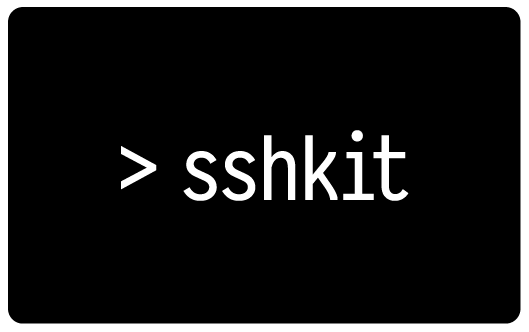

# Rake - Ruby Task Manager

Jim Weirich - Chief Scientist - EdgeCase
https://www.youtube.com/watch?v=AFPWDzHWjEY&t=13s


# Rake - Ruby Make

```
rake Rakefile
make Makefile
```

Rakefiles = Rake's version of Makefiles

### rake -P
### rake -T
### rake -T <word_to_search>
### rake -W <task_name>

# SSHKIT

SSHKit is a toolkit for running commands in a structured way on one or more servers.



https://github.com/capistrano/sshkit